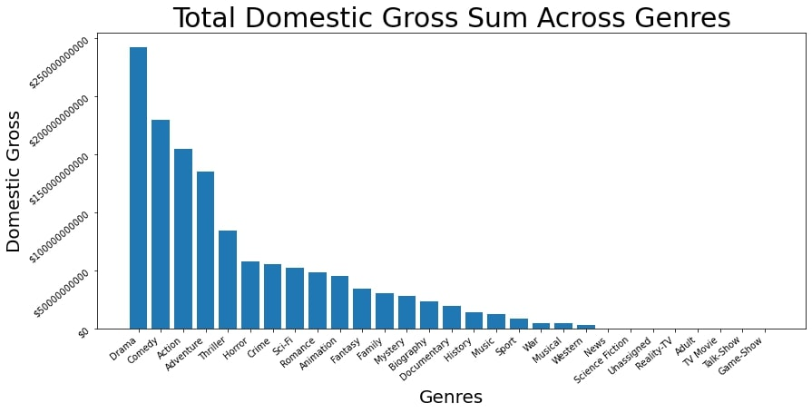
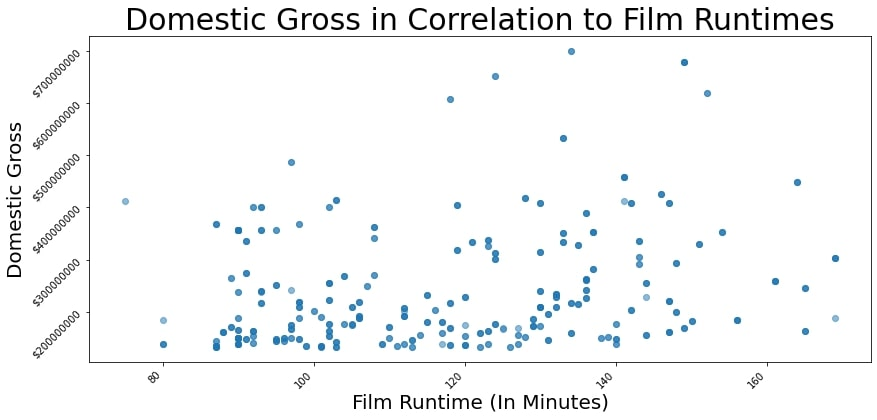
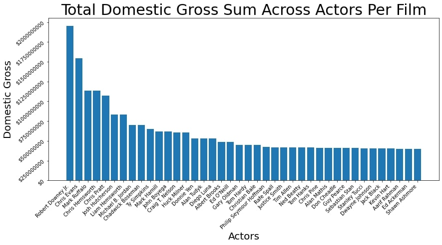

# Microsoft Movie Success Reccomendation Analysis
**Author**: [Michael Cuevas](mailto:kscuevas1297@gmail.com)


## Overview
This project is primarily going to focus on how Microsoft's upcoming film department can maximize their returning gross income from any potential movies they decide to make. I want to actively suggest looking at which genre of movies typically perform the best, which actors to include in said movie to entice consumers to purchase tickets and watch the film and recommend an average run time to aim for from start to finish.

### Business Problem
Microsoft sees all the big companies creating original video content and they want to get in on the fun. They have decided to create a new movie studio, but they don’t know anything about creating movies. You are charged with exploring what types of films are currently doing the best at the box office. You must then translate those findings into actionable insights that the head of Microsoft's new movie studio can use to help decide what type of films to create.

### Data

The data I'll be using from [Box Office Mojo](https://www.boxofficemojo.com/), [IMDB](https://www.imdb.com/) and [TheMovieDB](https://www.themoviedb.org/) respectively contain over 150,000 movie titles, and include information such as a movie's release year, the actor or actors that starred in their respective movies, filming runtime, vote counts, ratings, and domestic gross.

### Methods
This project will utilize data cleaning and combining, as well as descriptive analysis based on the outputs provided. This will best assist Microsoft with their decision making in how they want to proceed foward with creating their ideal movies that are successful.


## Results

Looking at the graph, it seems the best or top selling genre of movie to produce would be one that falls in the Drama genre. Some runner-ups genres to also consider for movie production would also be the Comedy, Action and Adventure genres as well. Or, possibly a combination of the top 4 most successful genres as seen above in possible multiple combinations for a future film.



Judging by the graph, the ideal runtime to aim for would be around 120 to 140 minutes (or between 2 hours, or 2 hours and 20 minutes). Alternatively, 130 minutes (2 hours and 10 minutes). Movies in this time frame seem to have the a higher chance of success in terms of domestic gross and compared to other movies and their runtimes.



In regards to potential and suitable actors, Robert Downey Jr seems to be the best candidate to choose when it comes to picking an actor to get the public's interests. Some other possible actors to consider contracting would also include: Chris Evans, Chris Hemsworth, Mark Ruffalo and Chris Pratt.




# Conclusions:
Our analysis results now give a better insight as to where Microsoft's new film production should focus their resources into: 
* **Genre:** Our top grossing genre results show us that the best ones to take advantage of are the Drama, Comedy, Adventure and Animation genres.
* **Runtime Average:** The best average runtime to aim for when it comes to any upcoming films should be between 120 and 140 minutes. Or, an overall runtime average of 130 minutes.
* **Actors to Consider:** To get the mass public's eyes, it would be ideal to contract out Robert Downey Jr., Chris Evans, Chris Hemsworth and Mark Ruffalo.
### Next Steps to Consider:
* **Directors:** On top of finding the best actors, it would also be good to find some of the best directors as well to bring onboard for any future film projects.
* **Budgeting:** Find and make an appropriate budget to take into consideration for filming so that the costs to produce doesn't outweigh the domestic gross returned once a film is released to the public for viewing.
* **Standalones or Sequels:** Decide if a film would be best as a standalone or as a series with either sequels or as a potential trilogy.


# Additional Information
There is a full and thorough analysis located in this [Jupyter Notebook](./student.ipynb). There is also a [presentation](./microsoft_movie_success_analysis.pdf) for any additional reviews needed.
For additional info, contact Michael Selleste Cuevas at [kscuevas1297@gmail.com](mailto:kscuevas1297@gmail.com)


# Repository
```
├── images
├── zippedData
├── .canvas
├── .gitignore
├── CONTRIBUTING.md
├── LICENSE.md
├── README.md
├── awesome.gif
├── microsoft_movie_success_analysis.pdf
└── student.ipynb
```

*(NOTE: This final project is a restoration of a previous fork that stopped working, hence the lack of commits.)*